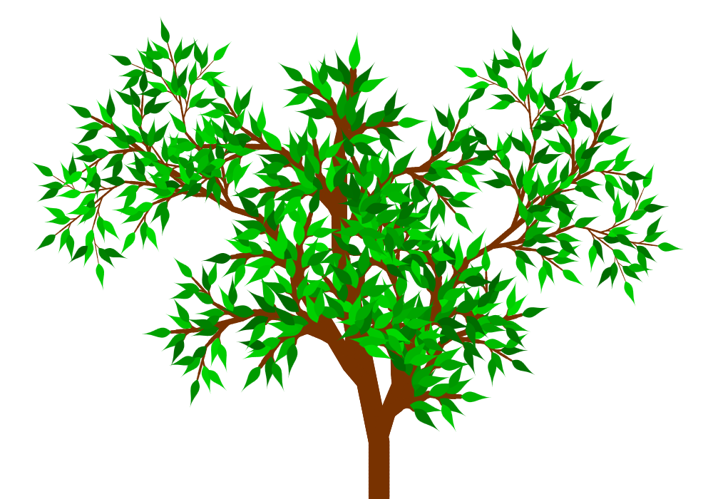

# LSys.js

LSys.js is a small Javascript library for rendering L-systems.

## Demo

Checkout the included [demo.html](https://cdn.rawgit.com/stevemuller04/lsys.js/master/demo.html) to see the library live in action.
It will produce a result similar to the following one.



## Basic usage

It is enough to include the library in the `<head>` your HTML document:

```html
<script type="text/javascript" src="lsys.js"></script>
```

Moreover, you will need a canvas element in the `<body>` which the L-system is drawn onto.

```html
<canvas id="my_canvas" width="800" height="600">
	<p>HTML5 canvas support required.</p>
</canvas>
```

Now instantiate the LSys instance and go ahead defining rules.

```javascript
var s = new LSys();

// The F and X symbols represent drawing operations
s.define("F", [ s.draw(6) ]);
s.define("X", [ s.draw(10) ]);

// Recursively replace X by some fancy pattern involving rotation
s.rule("X", [
	s.lit("F"),
	s.save(), s.rot(30), s.lit("X"), s.rot(30), s.lit("X"), s.restore(),
	s.lit("F"),
	s.save(), s.rot(-30), s.lit("X"), s.rot(-30), s.lit("X"), s.restore(),
	s.lit("F"),
	s.lit("F"),
	s.lit("X")
]);

// Double F in each step
s.rule("F", [ s.lit("F"), s.lit("F") ]);

// Render the L-system on the canvas with id "my_canvas" by using 5 recursion steps
s.renderAndFit([ s.lit("X") ], document.getElementById("my_canvas"), 5);
```

## Available methods

The following methods return a literal that can be used as a substitute in a rule or symbol definition.

* `LSys.leaf(base_size)`: Draws a leaf at the current position of the cursor. Its size is `base_size` pixels.
* `LSys.rot(angle)`: Rotates the cursor by the specified angle (in degrees, counter-clockwise).
* `LSys.randomrot(min_angle, max_angle)`: Rotates the cursor by an angle picked uniformly at random from the specified range.
* `LSys.thick(absolute_thickness)`: Sets the thickness of the line to draw to the specified value (in pixels).
* `LSys.relthick(relative_thickness)`: Thickens the line by the specified factor.
* `LSys.save()`: Saves the current state of the cursor onto a stack, ready to be re-established by `LSys.restore()`.
* `LSys.restore()`: Resets the state of the cursor to the last saved one.
* `LSys.move(distance)`: Moves the cursor ahead by the given distance in pixels without leaving a visual trace. Use `LSys.rot()` to change the heading.
* `LSys.draw(distance)`: Moves the cursor ahead by the given distance in pixels and draws the path travelled. Use `LSys.rot()` to change the heading.
* `LSys.lit(name)`: Gets a reference to the specified literal, which is replaced in a recursion step of the L-system.

To define the system, use the following methods.

* `LSys.rule(symbol_name, substitutes)`: Defines what happens with the specified symbol in a recursion step. In each such step, named symbols (as obtained by `LSys.lit()`) are replaced according to the rules by the respective list of substitutes. All other literals remain untouched (they are evaluated at the very end, see `LSys.define()`).
* `LSys.define(symbol_name, substitutes)`: Fixes the meaning of the symbol with the specified name. After the recursion phase, each leftover symbol is replaced by the given list of substitutes. Symbols that still remain now (this includes symbols for which there is no definition) are ignored. All other operations (drawing, moving, rotating, ...) are evaluated now.

Note that in both cases, `substitutes` must be an array of literals, each of of which must be obtained by some literal method (listed above).

A **literal** is any abstract object which has a specific meaning in an L-system. They may (but don't have to) have an effect on the output.
A **symbol** is a named literal. Symbols do not have a direct effect on the system, but a merely used as placeholders for a sequence of literals.

Finally, there are the output methods which evaluate the L-system.

* `LSys.measure(axiom, depth)`: Measures the dimensions of the drawing obtained by evaluating the L-system.
* `LSys.render(axiom, canvas, depth)`: Renders the output of the L-system to the given canvas (a reference to the DOM element).
* `LSys.renderAndFit(axiom, canvas, depth)`: Renders the output of the L-system to a canvas so that its content fits into the boundaries of the latter.

In each of them, `axiom` is the initial sequence of literals on which the rules are iteratively applied. Technically, `axiom` must be an array of elements, each of which must be a literal as obtained by some literal function (listed above).
The value of `depth` specifies how many recursion steps shall be applies.
